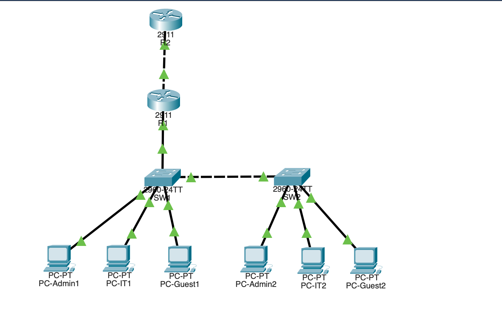
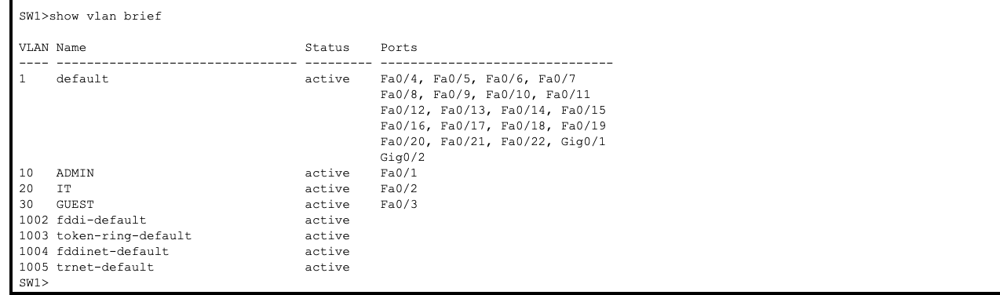
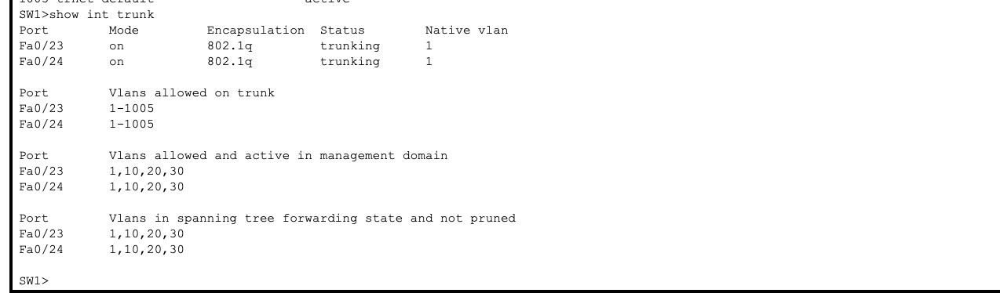
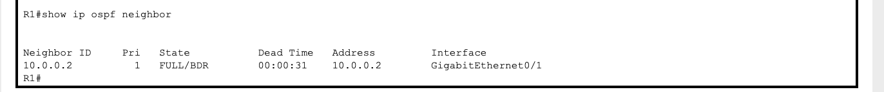
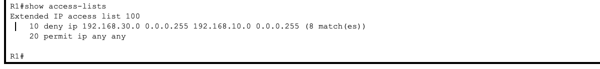

# Cisco Enterprise Network Project

## Overview
A small enterprise network designed and configured using Cisco Packet Tracer.

The project demonstrates routing, switching, VLAN segmentation, network services and security configuration.

## Network Topology

The network includes:
- 2 Routers
- 2 Switches
- 6 End Devices

## Technologies Used

- Cisco Packet Tracer
- VLANs
- Inter-VLAN Routing (Router-on-a-Stick)
- DHCP
- OSPF Dynamic Routing
- SSH Remote Management
- Access Control Lists (ACL)

## VLAN Configuration

| VLAN | Name | Network |
|------|------|---------|
| 10 | ADMIN | 192.168.10.0/24 |
| 20 | IT | 192.168.20.0/24 |
| 30 | GUEST | 192.168.30.0/24 |

## Routing

- OSPF Area 0 is configured between routers.
- Dynamic routing allows communication between networks.

## Services

### DHCP
Automatic IP address assignment is configured for all VLANs.

### SSH
Secure remote management is enabled on network devices.

## Security

An ACL is configured to block Guest VLAN access to the Admin VLAN while allowing other traffic.

Example:
- Guest → Admin ❌ Blocked
- Admin → Guest ✅ Allowed

## Verification Commands

## Screenshots

### Network Topology

### VLAN Configuration

### Trunk Configuration

### OSPF Neighbor

### ACL Security Configuration

### ACL Test Result

